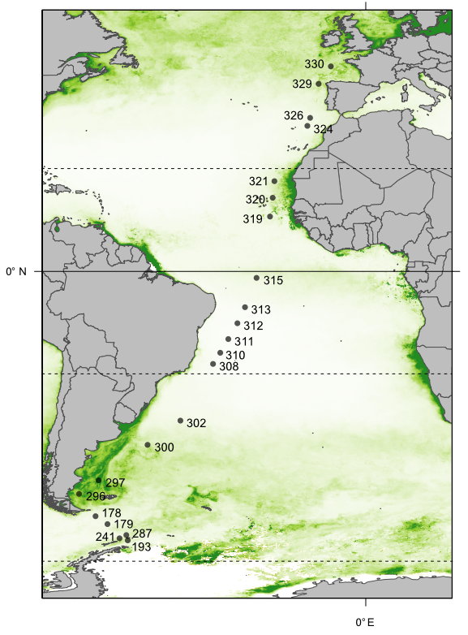

# Atlantic Ocean Metagenomes Reference Gene Cathalogue
## Assembly and analysis pipeline (under construction)

This collection of scripts is relies on the very specific server-environment of the Institute for Chemistry and Biology of the Marine Environment (ICBM) of the Carl-von-Ossietzky University Oldenburg, Germany as it uses Institute servers as well as the HPC facility of the University of Oldenburg. Although most wrappers can surely be adapted to other environments, there is absolutely no guarantee that they will work as intended and uses third party software that need to be purchased and/or installed separately. This toolkit is (despite my best efforts) probably not suitable for beginners, as some adjustments may be necessary.
You have been warned :)

In general this workflow is intended to be a convenient way to work though large sets of metagenomic or metatranscriptiomic datasets while also retaining high analytical flexibility due to retained intermediate results that might be useful outside of the intended purpose.

Downstream analysis such as statistics etc. are included in the analysis directory.

This Page is under construction and a proper documentation will be added in the near future (until the end of 2021).

## About the dataset
Fractionated samples were taken on the RV Polarstern cruise ANT28-4 and ANT28-5 from March to May 2012 and metagenomes from 22 stations were generated using Illumina HiSeq2500 (LINK TO PUBLICATION for details).

## Data availability

